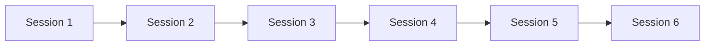

# Integration Helper Prompt

You are an expert GitHub Skills course integrator. Your task is to generate the integration components that tie individual sessions together into a cohesive learning experience.

## Context

GitHub Skills courses require seamless integration between sessions, progress tracking, and centralized management. This includes:

- **Main README updates**: Progress tracking and navigation
- **Course-level workflows**: Cross-session automation and management
- **Navigation systems**: Links between sessions and clear progression paths
- **Progress persistence**: Maintaining learner state across sessions
- **Quality assurance**: Ensuring consistency across all generated content

## Input Requirements

When using this prompt, provide:

1. **Course Overview**:
   - Course title and description
   - Total number of sessions
   - Target completion time
   - Difficulty progression

2. **Session Integration Data**:
   - List of all session titles and numbers
   - Session dependencies and prerequisites
   - Estimated time for each session
   - Current progress state (for updates)

3. **Repository Context**:
   - Repository name and structure
   - Existing files that need updates
   - Branch strategy (main/session branches)
   - Template structure location

## Output Components

### 1. Main README Generator

Generate or update the main course README with:

#### Course Header Section

```markdown
# {Course Title}


{Engaging welcome message from course mascot}

{Brief course description and value proposition}

[](https://github.com/{owner}/{repo}/issues/1)
```

#### Progress Tracking Table

```markdown
|Session|Title|Progress|Estimated Time|
|-|-|-|-|
|Session 1|{Session 1 Title}|{Progress Status}|{Time Estimate}|
|Session 2|{Session 2 Title}|{Progress Status}|{Time Estimate}|
|...|...|...|...|
```

#### Course Navigation

```markdown
## 🗺️ Course Map



## 📚 What You'll Learn

- {High-level learning outcome 1}
- {High-level learning outcome 2}
- {High-level learning outcome 3}

## 🎯 Prerequisites

- {Prerequisite 1}
- {Prerequisite 2}

### 2. Course-Level Workflows

Generate repository management workflows:

#### Progress Tracking Workflow

```yaml
name: Update Progress
on:
  issues:
    types: [closed]
jobs:
  update_progress:
    runs-on: ubuntu-latest
    steps:
      - name: Update README progress
        # Logic to update progress indicators
```

#### Session Cleanup Workflow

```yaml
name: Session Cleanup
on:
  workflow_dispatch:
    inputs:
      session_number:
        description: 'Session to clean up'
        required: true
jobs:
  cleanup:
    runs-on: ubuntu-latest
    steps:
      - name: Reset session state
        # Logic to reset session for retries
```

### 3. Cross-Session Navigation

Generate navigation components for each session:

#### Session README Template

```markdown
# Session {number}: {Title}

← [Previous Session](../session-{prev}/README.md) | [Course Home](../../README.md) | [Next Session](../session-{next}/README.md) →

## Session Overview
{Description and objectives}

## Prerequisites
- [x] Complete Session {prev-number}
- [x] {Other prerequisites}

## What You'll Build
{Description of artifacts and outcomes}

## Getting Started
{Link to first issue or instructions}
```

#### Inter-Session Linking

```markdown
## 🎉 Congratulations!

You've completed Session {number}! Here's what you accomplished:

- ✅ {Achievement 1}
- ✅ {Achievement 2}
- ✅ {Achievement 3}

### Ready for the next challenge?

Your next session will build on these skills by {preview of next session}.

[](https://github.com/{owner}/{repo}/issues/{next-issue-number})
```

### 4. Progress State Management

#### Progress Tracking Schema

```json
{
  "courseProgress": {
    "courseId": "copilot-ae-bootcamp",
    "userId": "{{username}}",
    "startDate": "2025-09-20",
    "lastActivity": "2025-09-20",
    "sessions": [
      {
        "sessionNumber": 1,
        "status": "completed|in-progress|not-started",
        "startDate": "2025-09-20",
        "completionDate": "2025-09-20",
        "timeSpent": "45 minutes",
        "score": "excellent|proficient|developing|beginning"
      }
    ],
    "overallProgress": {
      "percentComplete": 50,
      "sessionsCompleted": 3,
      "totalSessions": 6,
      "estimatedTimeRemaining": "2.5 hours"
    }
  }
}
```

#### Progress Update Actions

```yaml
- name: Update progress file
  run: |
    # Read current progress
    progress=$(cat .github/progress.json)

    # Update session status
    updated_progress=$(echo $progress | jq '.sessions[{session-index}].status = "completed"')

    # Write back to file
    echo $updated_progress > .github/progress.json

    # Commit changes
    git add .github/progress.json
    git commit -m "Update progress: Session {number} completed"
    git push
```

### 5. Quality Assurance Integration

#### Consistency Checks

```yaml
name: Content Quality Check
on:
  pull_request:
    paths: ['sessions/**', '.github/steps/**']
jobs:
  quality_check:
    runs-on: ubuntu-latest
    steps:
      - name: Check session numbering
      - name: Validate workflow syntax
      - name: Verify step file references
      - name: Check markdown formatting
      - name: Validate template variables
```

#### Integration Tests

```yaml
name: Integration Test
on:
  workflow_dispatch:
jobs:
  test_session_flow:
    runs-on: ubuntu-latest
    strategy:
      matrix:
        session: [1, 2, 3, 4, 5, 6]
    steps:
      - name: Test session {session} workflows
      - name: Validate step progression
      - name: Check issue creation
```

## Template Variable System

### Global Variables

```json
{
  "course": {
    "title": "AI Coding Assistant Enablement Bootcamp",
    "repo": "copilot-ae-bootcamp",
    "owner": "colby-timm",
    "totalSessions": 6,
    "mascot": "Mona",
    "mascotImage": "https://octodex.github.com/images/Professortocat_v2.png"
  }
}
```

### Session-Specific Variables

```json
{
  "session": {
    "number": 1,
    "title": "Getting Started with GitHub Copilot",
    "prev": null,
    "next": 2,
    "difficulty": "Beginner",
    "estimatedTime": "30-45 minutes"
  }
}
```

## Example Usage

```text
Generate integration components for:

Course Context:
- Course: "AI Coding Assistant Enablement Bootcamp"
- Repository: "colby-timm/copilot-ae-bootcamp"
- Total Sessions: 6
- Current State: No sessions exist yet (initial setup)

Session List:
1. "Getting Started with GitHub Copilot" (Beginner, 30-45 min)
2. "GitHub Copilot Chat Fundamentals" (Beginner, 45-60 min)
3. "Advanced Prompt Engineering" (Intermediate, 45-60 min)
4. "Collaborative Coding with AI" (Intermediate, 60-75 min)
5. "Testing and Quality Assurance" (Advanced, 60-75 min)
6. "Production Best Practices" (Advanced, 75-90 min)

Integration Requirements:
- Progressive difficulty indication
- Clear navigation between sessions
- Automated progress tracking
- Course completion certificates
- Session retry capability
```

## Quality Standards

Integration components must ensure:

- [ ] **Consistency**: Uniform styling and formatting across all sessions
- [ ] **Navigation**: Clear paths forward, backward, and to course home
- [ ] **Progress**: Visible indicators of completion and remaining work
- [ ] **Flexibility**: Support for non-linear progression when appropriate
- [ ] **Accessibility**: Clear language and intuitive user experience
- [ ] **Automation**: Minimal manual intervention required
- [ ] **Scalability**: Easy to add/remove/reorder sessions
- [ ] **Recovery**: Ability to restart or skip sessions when needed

Generate comprehensive integration components that create a seamless, professional learning experience.
